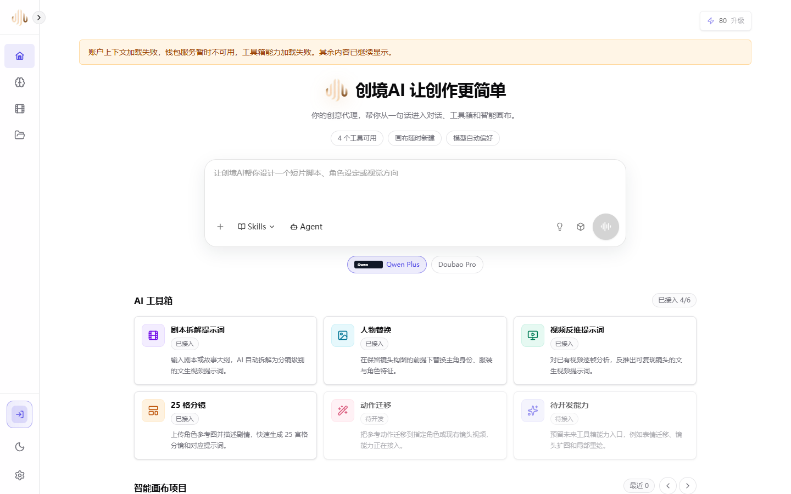

<p align="center">
  
</p>

<h1 align="center">XiaoLouAI</h1>

<p align="center">A Windows-native AI creation platform for image, video, script, storyboard, asset library, canvas workflow, playground, and enterprise management scenarios.</p>

<p align="center">
  <a href="./README.md">简体中文</a> | <a href="./README.en.md">English</a>
</p>

<p align="center">
  <a href="https://github.com/White-147/XiaoLouAI/actions/workflows/ci.yml"></a>
  
  
  <a href="./LICENSE"></a>
</p>

<p align="center">
  
</p>

XiaoLouAI is organized as a monorepo. The current production shape is a static React / Vite frontend, a .NET 8 ASP.NET Core control plane, PostgreSQL canonical storage, Windows service workers, and explicit provider / storage / local model adapter boundaries.

## Features

- AI toolbox home page for creative entry points, project navigation, account center, and lightweight tools.
- Image creation with references, asset library links, model selection, task creation, preview, download, and project asset sync.
- Video creation flow with image, video, and audio references plus duration, aspect ratio, model, and task queue parameters.
- Script and storyboard tools for prompt reverse engineering, five-column storyboards, and comic / short-video workflows.
- Playground for canonical conversations, messages, model configuration, memory preferences, and chat task validation.
- Canvas and agent-canvas entry points for project-based asset arrangement and debugging.
- Account, organization, wallet, API center, pricing, order, enterprise request, and permission-control flows.

## Tech Stack

| Area | Stack |
| --- | --- |
| Frontend | React 19, React Router 7, TypeScript, Vite 6, Tailwind CSS 4 |
| Control plane | .NET 8, ASP.NET Core Minimal APIs, xUnit |
| Database | PostgreSQL canonical tables, queues, advisory locks, LISTEN/NOTIFY |
| Workers | Windows service workers, ClosedApiWorker, LocalModelWorkerService |
| AI providers | Vertex Gemini image route, extensible closed API provider route |
| Storage | object storage abstraction, local object-storage provider, signed reads |
| Validation | Vitest, Playwright synthetic E2E, GitHub Actions, PowerShell gates |

## Local Development

```powershell
cd D:\code\XiaoLouAI\XIAOLOU-main
npm install
npm run dev
```

The full backend path requires local service configuration, PostgreSQL, provider credentials, and storage settings. Do not commit local secrets or runtime data.

## Run Records

Run records are split into stage files and indexed from [docs/run-records/README.md](docs/run-records/README.md). The root README only links to the index so that long operational notes stay out of the project introduction.

## License and Security

This repository uses the Apache License 2.0. See [LICENSE](LICENSE).

Security reporting instructions are in [SECURITY.md](SECURITY.md), and contribution notes are in [CONTRIBUTING.md](CONTRIBUTING.md).
