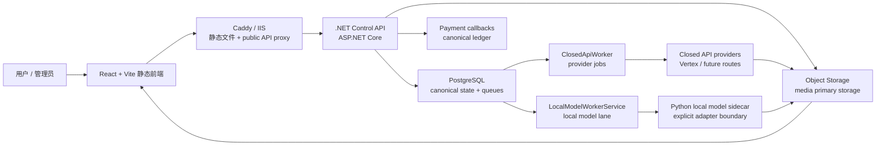
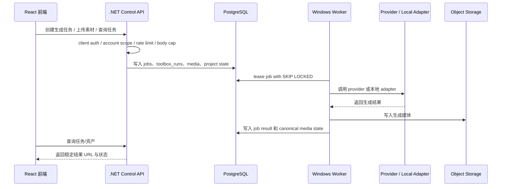

# XiaoLouAI

XiaoLouAI 是一个 Windows 原生 AI 创作平台，面向图片、视频、剧本、分镜、素材库、画布编排、Playground 调试和企业管理等内容生产场景。项目采用 React 前端、.NET Control API、PostgreSQL canonical 数据库、Windows Service workers 和对象存储组成一套可部署、可审计、可继续扩展的工程链路。

当前仓库已经整理为 monorepo。前端生产形态是静态 Vite build，后端生产控制面是 `.NET 8 / ASP.NET Core`，异步任务通过 PostgreSQL 队列和 Windows worker 执行。历史 Jaaz、Node `core-api`、Linux/Docker/Celery/Redis 方案仅保留为迁移参考，不作为当前生产入口。

> 说明：本仓库不包含真实生产密钥、真实 provider 账号、支付凭证、对象存储凭证、生产数据库 dump、运营证据或本地 runtime 数据。这些材料应保存在 `.runtime`、`deploy/local-secrets` 或运营方密钥/证据系统中，不能提交到 Git。

## 项目功能

- 首页与 AI 工具箱：统一展示创作入口、项目导航、账号中心和轻量工具能力。
- 图片创作：支持参考图、素材库引用、模型选择、任务创建、生成结果预览、下载和同步到项目资产库；Vertex Gemini 图片链路已接入真实出图路径。
- 视频创作：支持视频、图片、音频参考素材、比例/时长参数、模型选择和任务队列；视频 provider 适配仍按独立 owner 推进。
- 剧本与分镜工具：包含剧本拆解、视频反推提示词、25 格分镜、剧本广场和漫剧制作流程。
- Playground：用于 canonical 会话、消息、模型配置、记忆偏好和聊天任务验证。
- 原生画布与智能体画布：承载素材、生成节点、项目化编排和 Agent Canvas 调试入口。
- 资产与项目管理：按项目沉淀图片、视频、storyboard、dubbing、export 等资产，并通过 Control API 与 PostgreSQL canonical tables 保持一致。
- 账号、组织、钱包与管理后台：支持身份、组织成员、API-center 配置、钱包流水、价格规则、订单读取、企业申请和权限控制。
- 公网访问硬化：包含对象存储本地 provider 公开契约、API 限流/并发/body cap、Home-to-Playground 预热预算、稳定 metadata 短缓存/压缩和容量核验脚本。

## 技术栈

| 模块 | 技术 |
| --- | --- |
| 前端 | React 19、React Router 7、TypeScript、Vite 6、Tailwind CSS 4、lucide-react、motion、Three.js / React Three Fiber |
| 控制面 | .NET 8、ASP.NET Core Minimal APIs、xUnit |
| 数据库 | PostgreSQL，canonical tables、`FOR UPDATE SKIP LOCKED`、advisory locks、`LISTEN/NOTIFY` |
| 异步执行 | Windows Service workers、ClosedApiWorker、LocalModelWorkerService |
| AI / Provider | Vertex Gemini 图片生成链路、可扩展 closed API provider route、本地模型 sidecar 边界 |
| 存储 | 对象存储抽象、本地 object-storage provider、签名上传/读取、HTTP range media read |
| 部署 | Windows Service、Caddy/IIS 反向代理、PowerShell install/publish/register/preflight scripts |
| 测试与门禁 | Vitest、Playwright synthetic E2E、GitHub Actions、PowerShell verification gates、`dotnet test` |

## 系统架构



生产部署目标是 Windows 原生：静态前端由 Caddy/IIS 直接服务，API 请求转发到本机 `127.0.0.1:4100` 的 `.NET` Control API，Control API 和 workers 通过 PostgreSQL 与对象存储协作。生产流量不得路由到 Vite dev/preview server、Jaaz runtime、Node `core-api`、Docker、Linux、Kubernetes、Windows + Celery 或 Redis Open Source on Windows。

## 目录结构

```text
XiaoLouAI/
├── XIAOLOU-main/                       # React + Vite 前端；dist 为生产静态产物
│   └── src/features/                   # 按产品域组织的前端功能代码
├── backend/
│   ├── dotnet/control-plane/           # .NET Control API、Domain、Postgres/Storage infra、workers、tests
│   └── services/                       # 显式签过边界的 Python/local sidecar
├── deploy/
│   ├── caddy/                          # Caddy 静态站点 + API proxy 配置
│   ├── windows/                        # Windows proxy 示例、ops runbook、IIS/Caddy 样例
│   ├── records/                        # 本地阶段记录；默认被忽略，不 force-add
│   └── retained/                       # 非密 retained evidence/material
├── docs/                               # 架构、开发、部署、约束与运维说明
├── scripts/windows/                    # Windows install、publish、service、backup、verification scripts
├── XIAOLOU_REFACTOR_HANDOFF.md          # 当前短棒交接
├── .gitignore
└── README.md
```

`deploy/records/` 是本地长记录目录，默认不进入 Git；`XIAOLOU-main/dist/`、`.runtime/`、`deploy/local-secrets/` 和真实凭证/证据目录也不应提交。

## 核心创作链路

用户在前端提交图片、视频、Playground 或 toolbox 任务时，前端只调用 Control API DTO/API wrappers。Control API 完成身份、账号范围、权限、body cap 和限流检查后，把 canonical 状态写入 PostgreSQL，再由 Windows workers 租约执行任务。生成媒体写入对象存储，最终通过稳定 media URL 或 signed read URL 返回给前端。



## 数据、密钥与隐私说明

仓库只保留源码、配置模板、合成测试、非密 retained material 和运维脚本。以下内容不能提交：

- 真实生产数据库 dump、支付回放原文、provider 账号、对象存储密钥、CDN/WAF 凭证。
- `.runtime` 下的运行日志、产物、备份、证据和本地服务状态。
- `deploy/local-secrets` 下的真实 env、service-account、支付证书和运营材料。
- 原始 legacy runtime 目录作为生产入口恢复后的代码或依赖。

更多边界见 [工程约束](./docs/engineering-constraints.md) 和 [运维与证据边界](./docs/operations-and-evidence.md)。

## 本地开发

### 1. 前端

```powershell
cd XIAOLOU-main
npm install
npm run dev
```

前端 dev server 默认运行在：

```text
http://localhost:3000
```

常用环境变量：

```text
VITE_CORE_API_BASE_URL=http://127.0.0.1:4100
VITE_CORE_API_PROXY_TARGET=http://127.0.0.1:4100
```

### 2. .NET Control API

```powershell
cd backend/dotnet/control-plane
dotnet restore
dotnet build
dotnet run --project .\src\XiaoLou.ControlApi\XiaoLou.ControlApi.csproj
```

Control API 默认监听：

```text
http://127.0.0.1:4100
```

### 3. 常用验证

```powershell
npm --prefix .\XIAOLOU-main run lint
npm --prefix .\XIAOLOU-main run test:unit
npm --prefix .\XIAOLOU-main run build
dotnet test .\backend\dotnet\control-plane\XiaoLou.ControlPlane.sln --no-restore -v:minimal
powershell -NoProfile -ExecutionPolicy Bypass -File .\scripts\windows\verify-frontend-legacy-dependencies.ps1 -FailOnLegacyWriteDependency
powershell -NoProfile -ExecutionPolicy Bypass -File .\scripts\windows\verify-public-access-capacity.ps1
git diff --check
```

更详细的开发说明见 [开发与验证](./docs/development.md)。

## 部署说明

### 1. 构建前端静态产物

```powershell
cd XIAOLOU-main
npm ci
npm run build
```

生产静态文件输出到：

```text
XIAOLOU-main/dist
```

### 2. 发布 .NET 服务

推荐使用 Windows 脚本发布、注册并启动服务：

```powershell
.\scripts\windows\install.ps1 -RegisterServices -UpdateExisting -AssertDDrive
```

核心服务：

- `XiaoLou-ControlApi`
- `XiaoLou-ClosedApiWorker`
- `XiaoLou-LocalModelWorker`

### 3. 反向代理与公网入口

Caddy/IIS 应服务 `XIAOLOU-main/dist` 并只把已批准 public Control API routes 转发到 `127.0.0.1:4100`。生产入口必须阻断 `/api/internal/*`、`/api/schema/*`、`/api/providers/health`、`/metrics` 和未列入 public surface 的 legacy API。

上线或调参前运行：

```powershell
.\scripts\windows\rehearse-production-cutover.ps1 -StrictProduction
.\scripts\windows\verify-public-access-capacity.ps1
```

公网 smoke 可在有 public origin、client token 和对象样本时执行：

```powershell
.\scripts\windows\verify-public-access-capacity.ps1 `
  -RunHttp `
  -BaseUrl "https://xiaolou.example.com" `
  -ClientApiToken "<public client token or canary assertion>" `
  -ObjectContentPath "/api/media/object-content/<bucket>/<objectKey>"
```

完整 Windows 部署说明见 [Windows 部署与公网访问](./docs/deployment-windows.md) 和 [Windows ops runbook](./deploy/windows/ops-runbook.md)。

## 公网访问硬化状态

O 队列已收口：

- O2：本地 object-storage provider 通过 `/api/media/object-upload/*` 签名上传，通过 `/api/media/object-content/*` 稳定读取并支持 range。
- O3：Control API 和 Caddy/IIS 都有显式 public body cap、固定窗口和并发保护。
- O4：`/home` 不再隐藏挂载 Playground；只在焦点、输入、附件和发送等交互中预取 lazy route chunk。
- O5：只对稳定 JSON metadata routes 启用动态压缩、private `max-age=30` 和 weak ETag；SSE、range media、auth/payment/provider/operational 和账号态 reads 不进入该策略。
- O6：新增 `scripts/windows/verify-public-access-capacity.ps1`，默认离线核算 PostgreSQL pool、worker lease 吞吐、active-job polling 和 body caps；`-RunHttp` 可验证公网入口 cache/compression/range/p95/429。

## 项目亮点

- Windows-native production-first：前端静态站点、`.NET` Control API、Windows Service workers 和 PostgreSQL canonical state 的生产链路明确。
- 多模态创作闭环：图片、视频、剧本、分镜、素材库、Playground、画布和企业管理放在同一个产品域体系内。
- 公网可控边界：public routes、body limits、rate/concurrency guard、metadata cache/compression、object media route 和 capacity smoke 均有明确脚本或配置。
- 数据一致性清晰：账号、组织、钱包、项目、资产、Playground、Toolbox 和 jobs 都以 PostgreSQL canonical tables 为准。
- 存储边界清晰：媒体主存储是 object storage，本地 Windows 文件夹只做 cache/temp。
- 历史系统隔离：Jaaz、Node `core-api`、legacy payment/runtime 等路径保留为迁移参考，不再是默认生产控制面。
- 测试门禁明确：前端 lint/unit/build、后端 xUnit/Release build、legacy dependency gate、synthetic E2E 和 public capacity gate 都有可执行入口。

## 文档导航

- [总体架构](./docs/architecture.md)
- [开发与验证](./docs/development.md)
- [Windows 部署与公网访问](./docs/deployment-windows.md)
- [工程约束](./docs/engineering-constraints.md)
- [运维与证据边界](./docs/operations-and-evidence.md)
- [Windows ops runbook](./deploy/windows/ops-runbook.md)
- [短棒交接](./XIAOLOU_REFACTOR_HANDOFF.md)

## 后续可改进方向

- 补充公开演示截图、核心页面录屏和 provider/mock 运行示例。
- 为视频 provider、Playground web search/attachments、本地模型真实 adapter 分别创建独立 owner。
- 将真实生产域名、provider、支付和对象存储证据接入运营方密钥/证据系统，而不是写入仓库。
- 在已有 synthetic E2E 和 xUnit 基础上，继续评估非必需的覆盖率、安全扫描和性能基线门槛。
- 按需把 `deploy/records` 中已收口的阶段记录整理成发布说明或 CHANGELOG。

## Final Legacy Surface Positioning

- `backend/dotnet/control-plane/` is the production control plane for the current Windows-native runtime.
- `core-api/` is retained only as a Node compatibility layer and migration reference under `legacy/core-api`, not as a production API entrypoint.
- `services/api/` is retained only as a legacy Python API reference; not production control plane under `legacy/services-api`.
- The `legacy/core-api` and `legacy/services-api` trees are archived legacy references for audit and migration comparison until approved deletion.

## License

MIT
